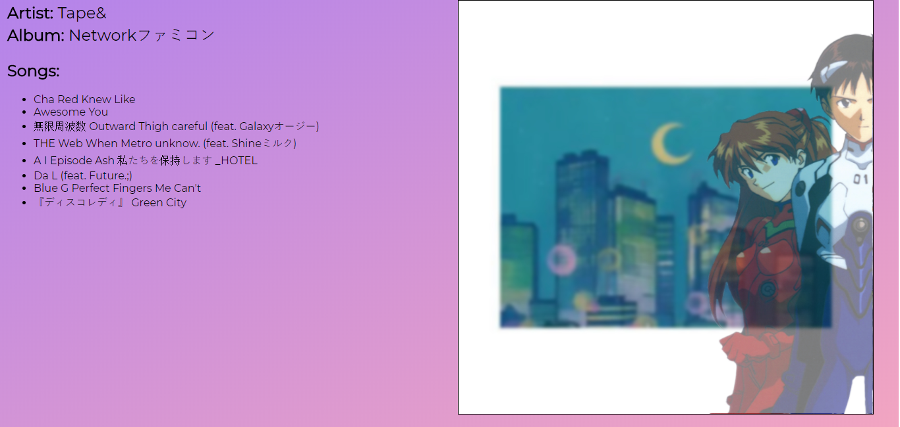
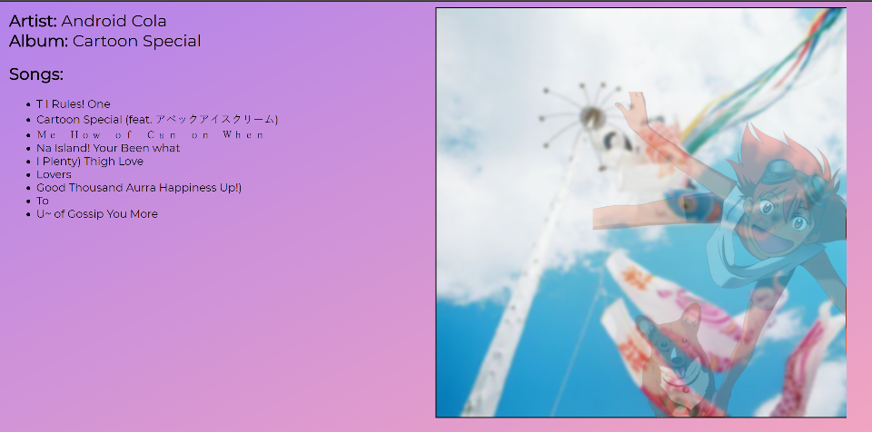
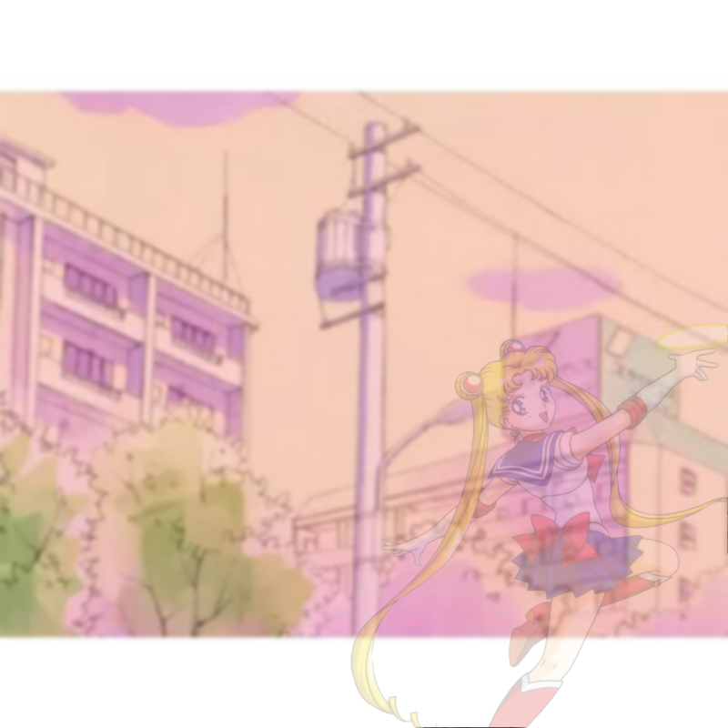
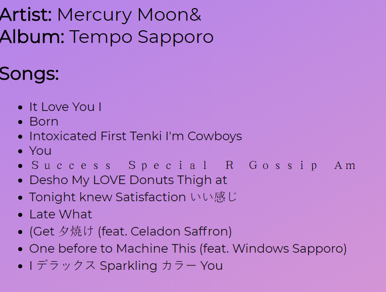

Future Funk Generator

generates an artist, album, song titles, and album art to help you start your future funk soundcloud career

---

run npm install once this repo is downloaded

then hop into a terminal and run `node index.js`

finally open a browser and head to localhost:3000

---

